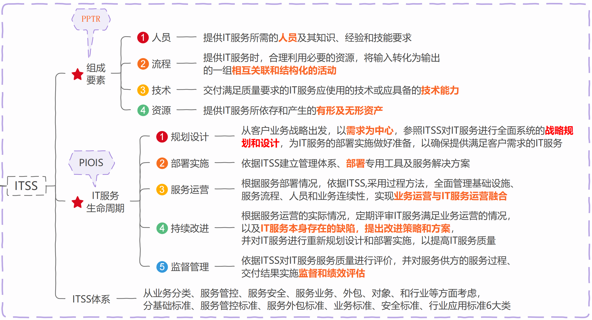
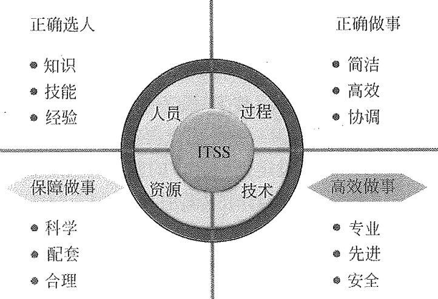
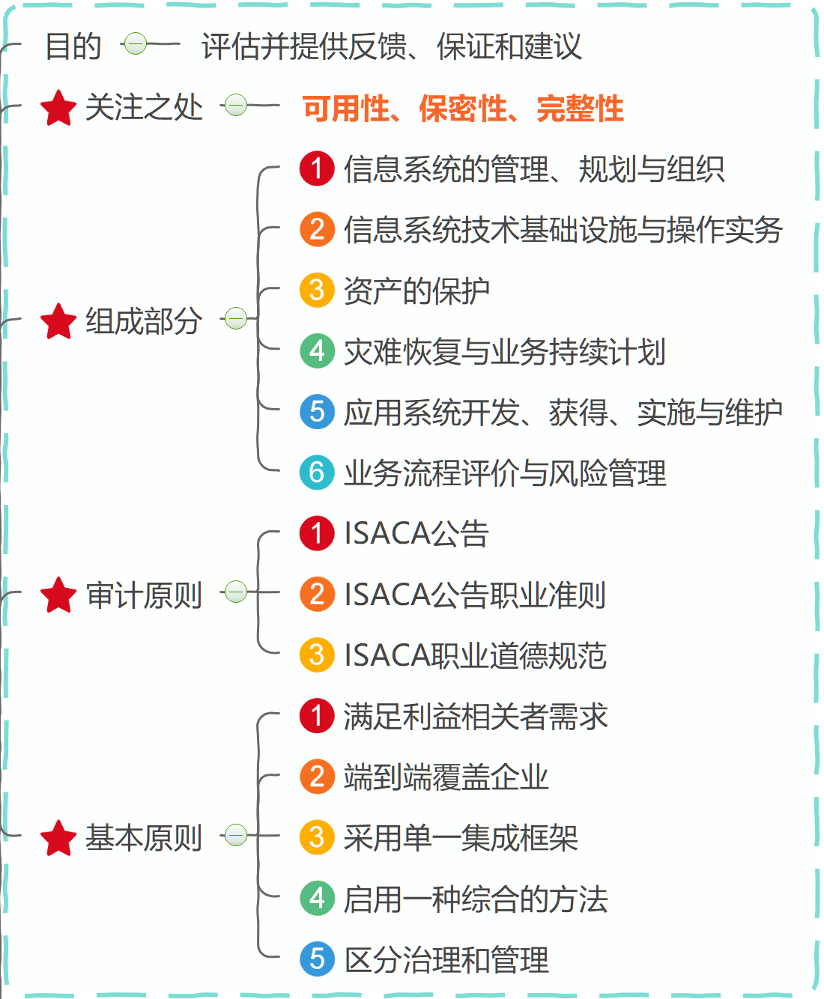
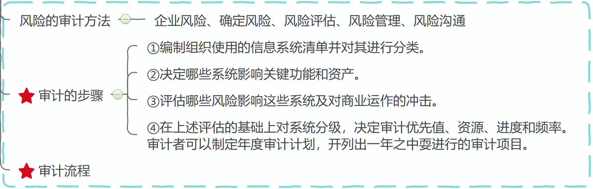

# 02 服务管理

## ITSS

  
  

## 信息审计系统

  
  

## 试题

- 【例 1 】 信息技术服务标准（ ITSS ）定义了 IT 服务的核心要素由人员、过程、技术和资源组成。（）
  要素关注“正确做事”。
   A. 人员
   B. 过程
   C. 技术
   D. 资源

- 【例 2 】 信息技术服务标准（ ITSS ）。
   A. 工具、技术、流程、服务
   B. 人员、过程、技术、资源
   C. 计划、执行、检查、纠正
   D. 质量、成本、进度、风险

- 【例 3 】 信息技术服务标准（ ITSS ）的 IT 服务生命周期模型中（）是在规划设计基础上依据 ITSS 建
  立管理体系、提供服务解决方案。
   A. 服务战略
   B. 部署实施
   C. 服务运营
   D. 监督管理
- 【例 4 】 信息技术服务标准（ ITSS ）是套成体系和综合配套的标准库 用于指导实施标准化和可信赖
  的 IT 服， ITSS 定义的服务生命周期不包括（）。
   A. 战略部署
   B. 规划设计
   C. 部署实施
   D. 服务运营

- 【例 5 】 信息技术服务标准（ ITSS ）定义了 IT 服务的核心要素由人员、过程、技术和资源组成。（）
  要素关注“正确做事”。
   A. 人员
   B. 过程
   C. 技术
   D. 资源
- 【例 6 】 信息技术服务标准（ ITSS ）。
   A. 工具、技术、流程、服务
   B. 人员、过程、技术、资源
   C. 计划、执行、检查、纠正
   D. 质量、成本、进度、风险
- 【例 7 】 信息技术服务标准（ ITSS ）的 IT 服务生命周期模型中（）是在规划设计基础上依据 ITSS 建
  立管理体系、提供服务解决方案。
   A. 服务战略
   B. 部署实施
   C. 服务运营
   D. 监督管理
- 【例 8 】 信息技术服务标准（ ITSS ）是套成体系和综合配套的标准库 用于指导实施标准化和可信赖
  的 IT 服， ITSS 定义的服务生命周期不包括（）。
   A. 战略部署
   B. 规划设计
   C. 部署实施
   D. 服务运营

- 答案
  B
  B
  B
  A
  D
  D
  D
  D
