# 09 成本管理

<https://boardmix.cn/app/editor/zUOYRXhbHuH0O40jjgevog>

 

## 成本

 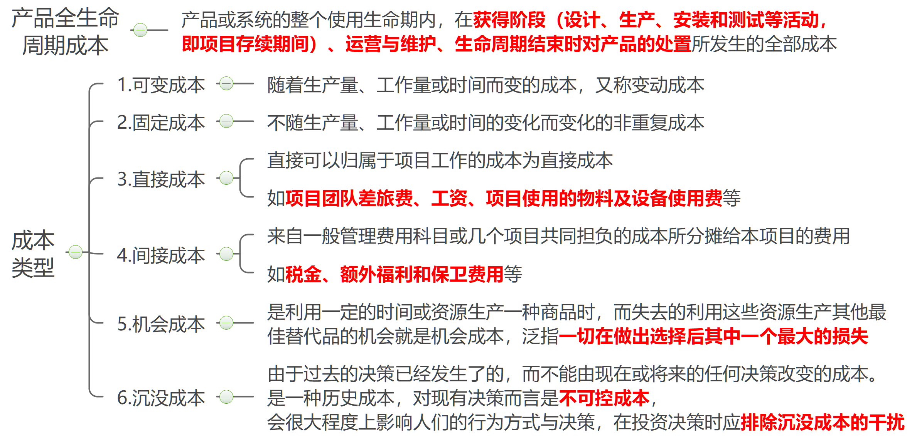  

## 储备

### 应急储备

为未规划但可能发生的变更提供的补贴，这些变更由风险登记册中所列的已知风险引起。\*\*

1.  应急储备由PM 负责管理。
2.  PM 可支配应急储备。
3.  应急储备是为将来应对的“已知的未知风险”做准备的储备。
4.  应急储备是是成本绩效基准的一部分，也属于项目预算。
5.  若无估算依据，应急储备可按总成本的一定比例（例如 10%）计算。

### 管理储备

管理储备则是为未规划的范围变更与成本变更而预留的预算。

1.  管理储备是为预先考虑的那些“未知的未知风险”做准备的储备。
2.  管理储备由发起人或管理层负责管理。
3.  PM 使用管理储备，需要向发起人或管理层申请。
4.  管理储备是项目预算的一部分。
5.  管理储备不是成本基准的一部分。
6.  管理储备不纳入挣值 计算。
7.  管理储备在项目的结束点反映。
8.  管理储备的多少取决于管理层对风险的判断，若无估算依据，管理储备可按总成本的一定比例（例如 10%）计算。

 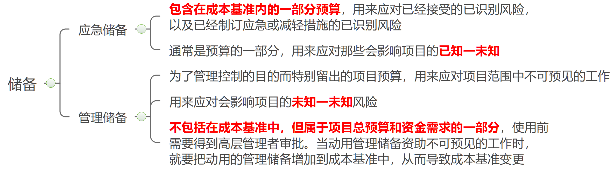  
 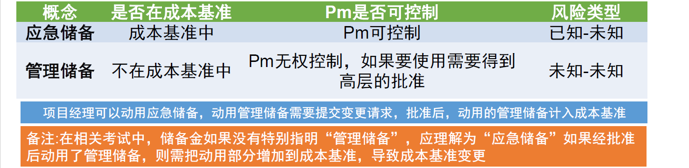  

## 成本管理计划

 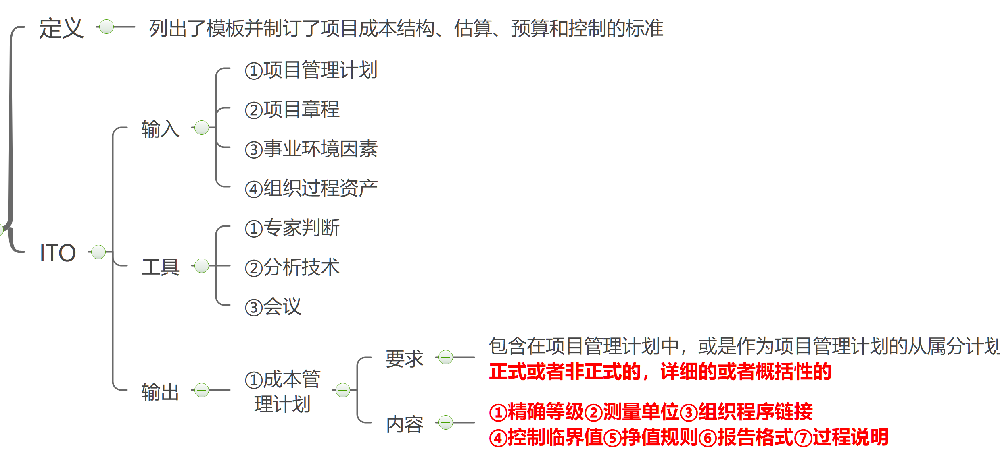  

## 成本估算

 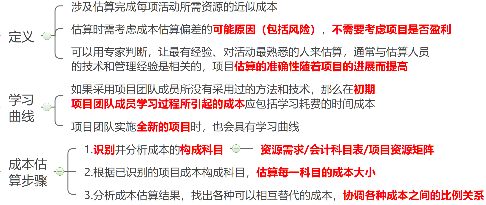  

  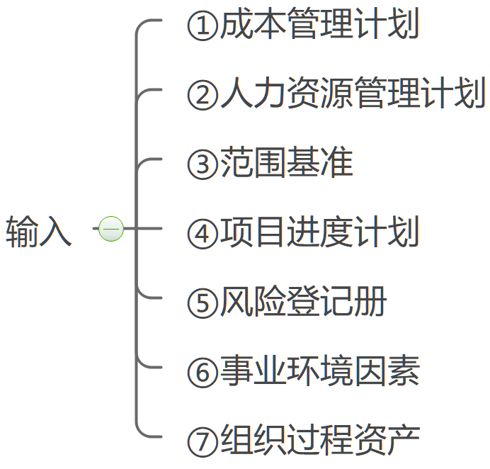
  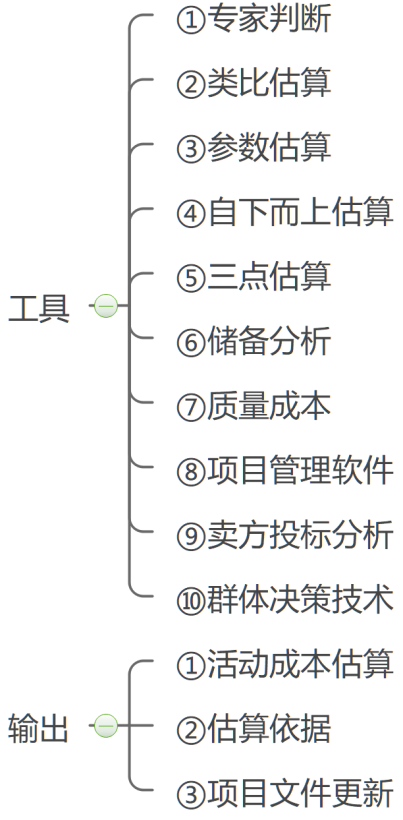

## 成本预算

 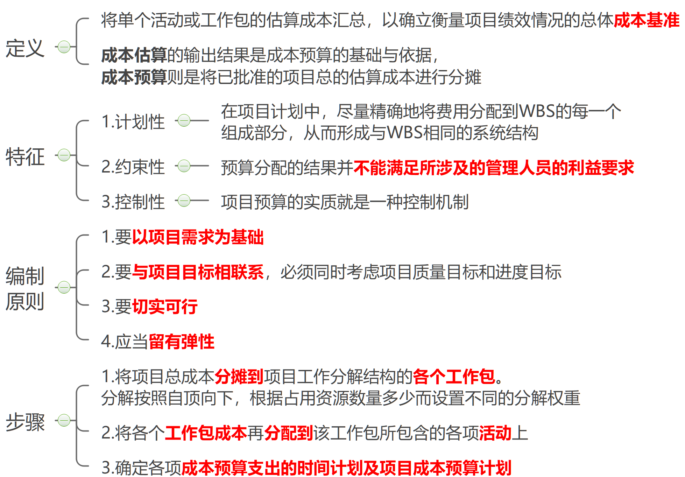  

  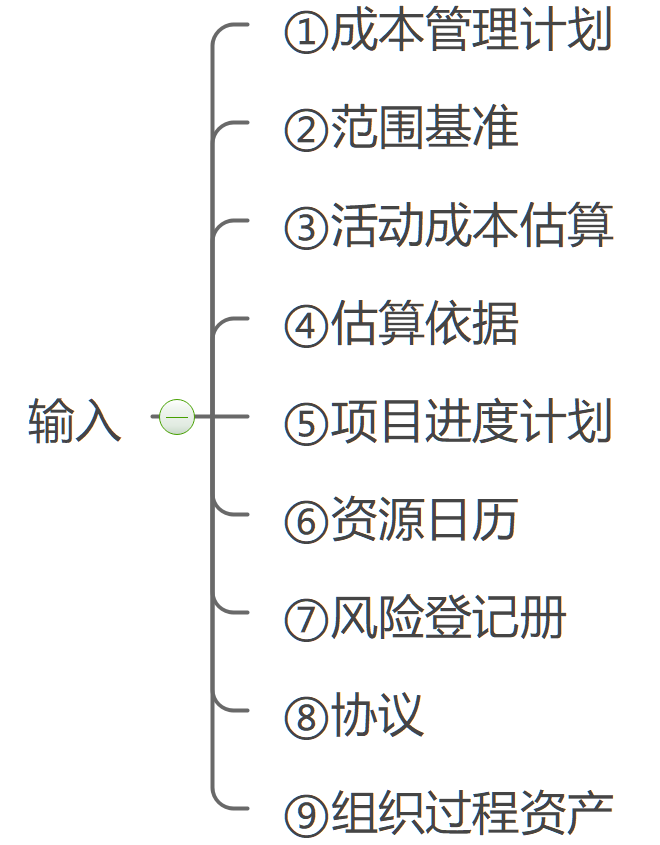
  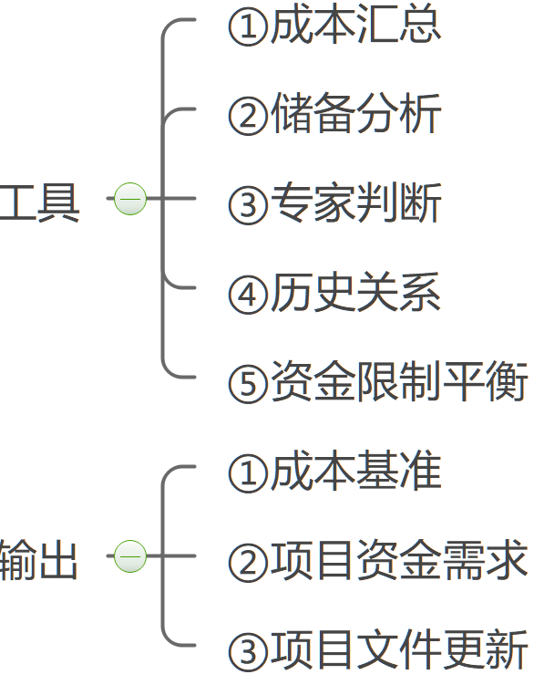

  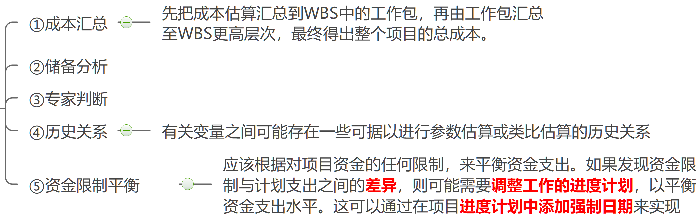

::: tip

1.  项目资金需求 成本基准 + 管理储备 。项目资金通常以 阶梯状 的形态， 增量而非连续的方式投入。
2.  成本基准中既包括预计的支出，也包括预计的 债务 。
3.  成本基准包括应急储备，不包括管理储备。

:::

 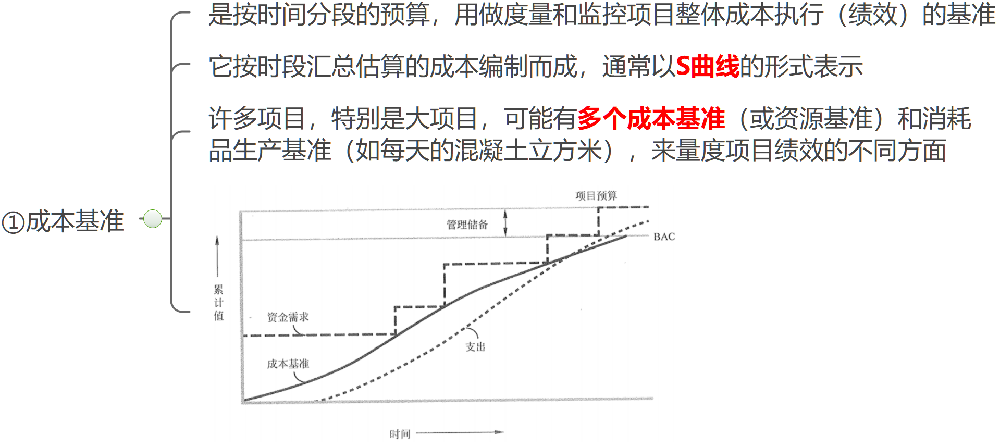

## 成本控制

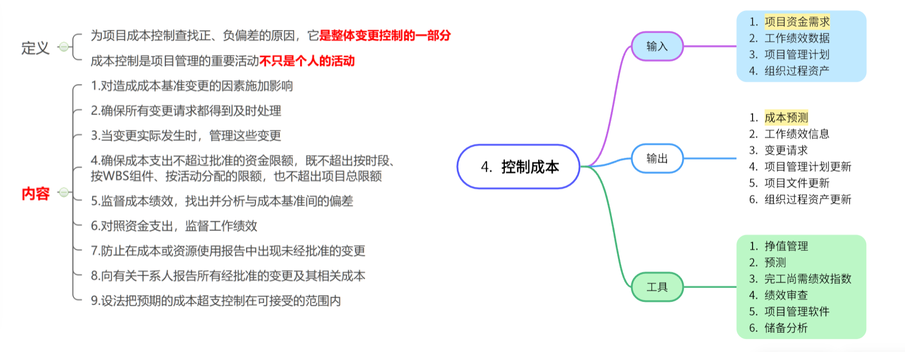

### 挣值分析计算

 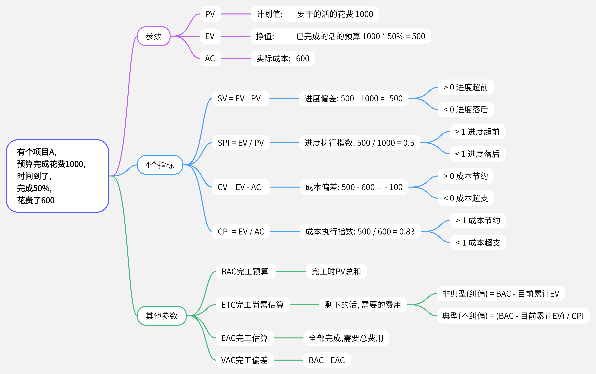
