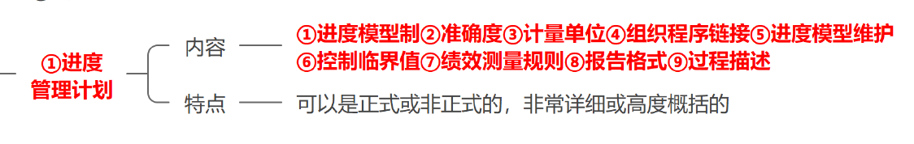
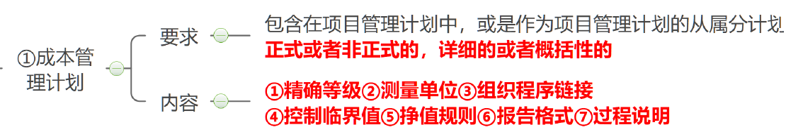

# 常见知识点

## 项目干系人

  

## 事业环境因素

  

## 组件过程资产

  

## 项目管理过程组

  

- 项目管理过程组： 启动、规划、执行、监控、收尾 ；在所有项目上都是一样的

- 五大过程组可以在每个项目阶段执行和重复执行，也可以在整体项目层面执行和重复执行

- “项目管理生命周期” 和 “项目生命周期” 有相同的起点和终点

- 五大过程组可以对应到 PDCA 戴明环， 规划对应 P ，执行对应 D ，监控对应 C 和 A

- 启动过程组：制定项目章程、识别项目干系人；

- 收尾过程组：结束项目或阶段、结束采购

  

## 项目建议书

- 项目建议书:【第 5 章】立项管理

  

## 项目工作说明书

  

## 项目章程

- 定制项目章程:【第 6 章】项目整体管理

  

## 项目管理计划

- 定制项目管理计划:【第 6 章】项目整体管理

  

## 范围管理计划

- 定制范围管理计划:【第 7 章】项目范围管理

  

## 需求管理计划

- 定制需求管理计划:【第 7 章】项目范围管理

  

## 需求文件,需求矩阵

- 定制需求文件,需求矩阵:【第 7 章】项目范围管理

  

## 项目范围说明书

  

## WBS

  

## 进度管理计划

  

## 成本管理计划

  

## 工具

### 专家判断

### 引导技术

### 会议

1. 交互信息
2. 头脑风暴, 方案评估或者方案设计
3. 制定决策

### 项目管理信息系统

提供工具:

- 进度计划工具
- 工作授权工具
- 配置管理工具
- 信息收集与发布工具

### 分析技术

  

### 引导式研讨会

具有不同期望或专业知识的关键人物参与研讨会, 有助于项目目标和项目限制达成跨职能的共识

### 备选方案识别

用来定制尽可能多的潜在可选方案技术, 用于识别执行项目工作的不同方法

### 访谈

正式或者非正式, 一对一会谈, 或者一对一访谈

### 焦点小组

一对一的扩展形式, 加入了专家, 专门的主持人, 分主题, 分小组

### 原型法

制造模型, 征求反馈, 支持渐进明细

### 问卷调查

快速, 受众多, 统计分析

### 观察

工作跟踪, 参与式和旁站式，不愿说、不能说、说不出来

### 群体创新技术

  

### 群体决策技术

  

### 类比估算

  

### 参数估算

  

### 自上而下估算

  

### 三点估算

  

### 储备分析

  
